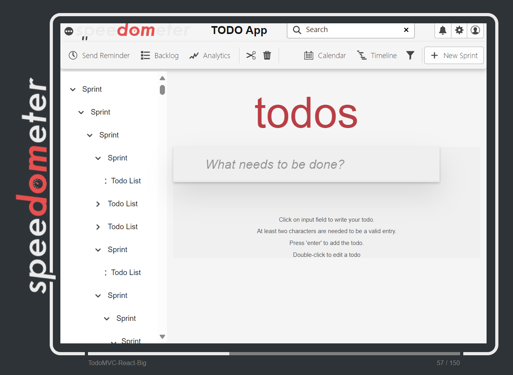

# TodoMVC embedded in a complex big static DOM

## The benchmark

This workload embeds the todoMVC benchmark in an html page with the following characteristics.

- The page is a big static DOM with around 4000 elements.
- The page is styled using the @spectrum-css adobe library, which relies on css variables for uniform styling.
- The @spectrum-css rules of the page are post processed using postcss and purgecss.
- The page includes other ~64 complex color css rules using different kinds of css selectors and combinators.
- ~14 of the above rules will fully match elements added by the todoMVC benchmark, but not elements in the UI.
  - E.g. `.todo-area .show-priority li[data-priority="2"].completed`.
- ~50 of the above rules will partially match elements added by the todoMVC benchmark (the right most selector will match).
  - E.g. `.backlog-group li > div > :checked ~ label`.
- We added a new class `show-priority` to the todoMVC benchmark list items. We also added a attribute `data-priority`.

<p align = "center">

</p>

## Structure of the folder

- _src_ Code to generate the big static DOM
- _dist_ - Output folder for the big static DOM generator.
- utils - Folder for the functions to generate the complex DOM versions of each architecture as well as add additional css.

## How to run

`npm run build` - Generates the static html and corresponding css.

`npm run serve` - Serves the dist folder in port 7002.

## The generator

The generator is a nodejs script that uses `renderToStaticMarkup` to generate the static html.

### Dom Generator

- Uses a random seedable library with a default seed for all its random operations.
- Takes `MAX_DEPTH`, `TARGET_SIZE` and to randomly generate the big folder-like structure embedded in the sidebar.
- To generate the sidebar, each node decides if it will have children based on the `CHILD_PROB` value. Then randomly chooses a number of children between 1 and `MAX_BREADTH`.

## Install using local path

In the project where we want to use the big-dom-generator package, for example, `Speedometer/resources/todomvc/architecture-examples/react-complex` run:

```bash
npm install ../../big-dom-generator --save-dev
```

The flag `--save-dev` will create an entry in the package.json if one doesn't already exist. Now you can use the package in the project as if it was installed from npm.

## Utils
### `buildComplex.js`
This JavaScript file is used to build a complex DOM and generate an HTML file.

The buildComplex function takes several parameters, including the caller directory, source directory, title, files to move, extra CSS to link, and scripts to link. It removes the dist directory if it exists and generates a new index.html file in the dist directory which is the application embedded in the complex DOM.

## Additional CSS

### What's so special about javascript-web-components and lit TodoMVC?

The shadow dom is a special dom that is attached to a web component. This is a great feature for web components, but it also means that the css rules of the page will not affect the shadow dom of the web component. To address this we created some util modules so that we can add the additional css rules to the shadow dom of the `todo-list` and and in the `list-items`.

### `add-todo-list-extra-css.js`
This JavaScript file defines additional CSS styles for a to-do list. It creates a new CSSStyleSheet object called additionalTodoListStyleSheet and sets the styles for the :host(.show-priority) selector.

The styles include CSS variables for border colors, background colors, text colors, and box shadows. These variables are used to define the styles for completed and not completed to-do list items based on their priority level.

The additionalTodoListStyleSheet object is then assigned to the window.extraTodoListCssToAdopt property, which can be used to apply the additional styles to the to-do list.

### `add-todo-item-extra-css.js`
This JavaScript file defines additional CSS styles for a to-do list item. It creates a new CSSStyleSheet object called additionalStyleSheet and sets the styles for the li.completed and li:not(.completed) selectors.

The styles include CSS variables for border colors, background colors, and text colors. These variables are used to define the styles for completed and not completed to-do list items.

The additionalStyleSheet object is then assigned to the window.extraCssToAdopt property, which can be used to apply the additional styles to the to-do list.

### There is a slight difference between `add-todo-item-extra-css.js` and `javascript-web-components/add-todo-item-extra-css.js`
Given the slight structural difference between javascript-web-components & lit there are different selectors used.

**Javascript-web-components** uses the following selectors:
- `const selectors = [':host([completed="true"]) li', ':host([completed="false"]) li'];`

**lit** uses the following selectors:
- `const selectors = ["li.completed", "li:not(.completed)"];`