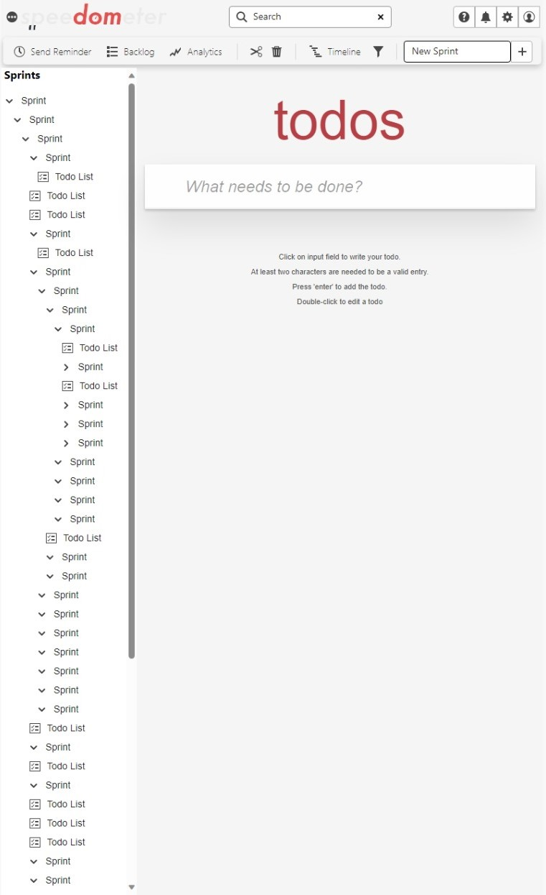

# TodoMVC embedded in a complex big static DOM

The complex DOM workloads embed the different TodoMVC implementations into a static page formed by a big DOM and complex CSS. Their purpose is to capture the performance impact of executing seemingly isolated actions (e.g. adding/deleting todo items) in the context of a complex website.

The complexity of the CSS is represented by adding rules composed by complex selectors and combinators. We split the added selectors into **matching** and **non-matching** rules. All the matching selector will fully match an element added by the TodoMVC benchmark, but not elements in the UI. The non-matching selectors will partially match elements added by the TodoMVC benchmark (at least the right most selector will match), and will have a visual impact in the surrounding UI. These ensure that we capture the performance impact of the added CSS rules within the measured time.

## Workload description

The static page with the following characteristics.

-   The DOM has around 6000 elements.
-   The page is styled using the @spectrum-css adobe library, which relies on css variables for uniform styling.
-   The @spectrum-css rules of the page are post processed using postcss and purgecss.
-   Additional styling is applied through ~50 non-matching CSS rules.
    -   E.g. `.backlog-group li > div > :checked ~ label`.

All TodoMVC versions now have a `show-priority` class name in the `<ul>` element and a `data-priority` attribute in the `li` elements. These are used by the matching CSS rules.

-   We added ~14 matching CSS rules.
    -   E.g. `.todo-area .show-priority li[data-priority="2"].completed`.
    -   In the case of Javascript-web-components and lit TodoMVC, we added the `show-priority` class to the `<todo-list>` custom element and the `data-priority` attribute to the `<todo-item>` custom element.

### Web components based workloads

The Shadow DOM isolation prevents global CSS rules to be applied to its children, hence, having matching or non-matching rules doesn't have the same impact as with the other architectures. Instead, the Complex DOM Web components and Lit workloads stress the use of CSS variables inherited though the shadow DOM boundary:

-   Some default variables are defined in the `root` element.
-   The `add-todo-list-extra-css.js` file defines a constructable stylesheet that will declare the priority colors only if the `show-priority` class is present in the host.
-   The `add-todo-item-extra-css.js` file defines the rule to style the todo items based on their priority level.

## UI shell

<p align = "center">

</p>

## The generator

The big DOM is produced by generator in a nodejs script that uses `renderToStaticMarkup` to generate the static html. It uses a random seedable library to generate the random folder-like structure embedded in the sidebar. The generator takes the following parameters:

-   `MAX_DEPTH` - Maximum depth of the generated DOM.
-   `TARGET_SIZE` - Number of elements in the generated DOM.
-   `CHILD_PROB` - Probability of each element of the sidebar to have children.
-   `MAX_BREADTH` - Maximum number of children of each element of the sidebar.

## Structure of the folder

-   _src_ Code to generate the big static DOM
-   _dist_ - Output folder for the big static DOM generator.
-   utils - Folder for the functions to generate the complex DOM versions of each architecture as well as add additional css.

## How to run

`npm install` - Installs the dependencies.

`npm run build` - Generates the static html and corresponding css.

`npm run serve` - Serves the dist folder in port 7002.

## Install using local path

In the project where we want to use the big-dom-generator package, E.g. `Speedometer/resources/todomvc/architecture-examples/react-complex` run:

```bash
npm install ../../big-dom-generator --save-dev
```

The flag `--save-dev` will create an entry in the package.json if one doesn't already exist. Now you can use the package in the project as if it was installed from npm.

## Developer notes

-   The non-matching selectors were written so that elements within the todoMVC matched more than the right-most selector, for example, the `label` element in the todo items matches the selector `backlog-group li > div > :checked ~ label` up to the `li` simple selector. Any changes to the DOM structure withing the todoMVC will require us to reevaluate and potentially rewrite these selectors.
-   Angular uses custom elements, so the todoMVC elements might match a smaller part of the selector compared to other architectures.
